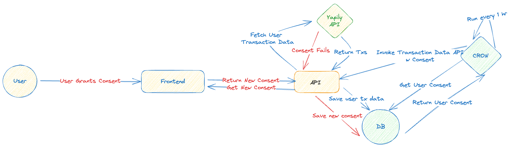

# REST API using Yapily

This REST API is built using NestJS and Prisma and interacts with the Yapily API to manage bank accounts, authorize accounts, get user consent, get user accounts, and fetch account transactions.

## Running the Application

1. Clone the repository and navigate to the project directory.

2. Install the necessary dependencies by running:
```
npm install
```

3. Run the application using:
```
npm run start
```
The application will be running at `http://localhost:3000`.

## API Endpoints

The API consists of the following endpoints:

- `GET /accounts`: Fetch all bank accounts.
- `POST /accounts/authorize`: Authorize a bank account by providing the user ID.
- `GET /accounts/consent`: Fetch the consent for a given consent string.
- `GET /accounts/userAccounts`: Fetch all bank accounts associated with a user.
- `POST /accounts/accountTransactions`: Fetch all transactions for a given account ID.

## Database Schema

The application uses a PostgreSQL database with the following schema:

- `User`: This table stores user information. Each user has an `id`, `email`, `createdAt`, `updatedAt`, and optionally a `consent` and `bankAccounts`.

- `Consent`: This table stores consent information. Each consent record has an `id`, `userId`, `consent`, `expiry`, `createdAt`, `updatedAt`, and a `user`.

- `BankAccount`: This table stores bank account information. Each bank account has an `id`, `type`, `balance`, `currency`, `usageType`, `accountType`, `nickname`, `userId`, `user`, `accountNames`, `accountIdentifications`, `accountBalances`, and `transactions`.

- `Transaction`: This table stores transaction information. Each transaction has an `id`, `date`, `bookingDateTime`, `valueDateTime`, `status`, `amount`, `currency`, `reference`, `description`, `transactionInformation`, `isoBankTransactionCode`, `proprietaryBankTransactionCode`, `balance`, `enrichment`, `bankAccountId`, and `bankAccount`.

- `AccountIdentification`: This table stores account identification information. Each account identification has an `id`, `identification`, `bankAccountId`, and `bankAccount`.

- `AccountBalance`: This table stores account balance information. Each account balance has an `id`, `balance`, `currency`, `bankAccountId`, and `bankAccount`.

- `AccountName`: This table stores account name information. Each account name has an `id`, `name`, `bankAccountId`, and `bankAccount`.

The `User`, `Consent`, and `BankAccount` tables are related. Each `User` can have multiple `BankAccounts` and one `Consent`. Each `Consent` is associated with one `User`. Each `BankAccount` is associated with one `User` and can have multiple `Transactions`, `AccountIdentifications`, `AccountBalances`, and `AccountNames`.


## Workflow to sync data on DB with Yapily API

